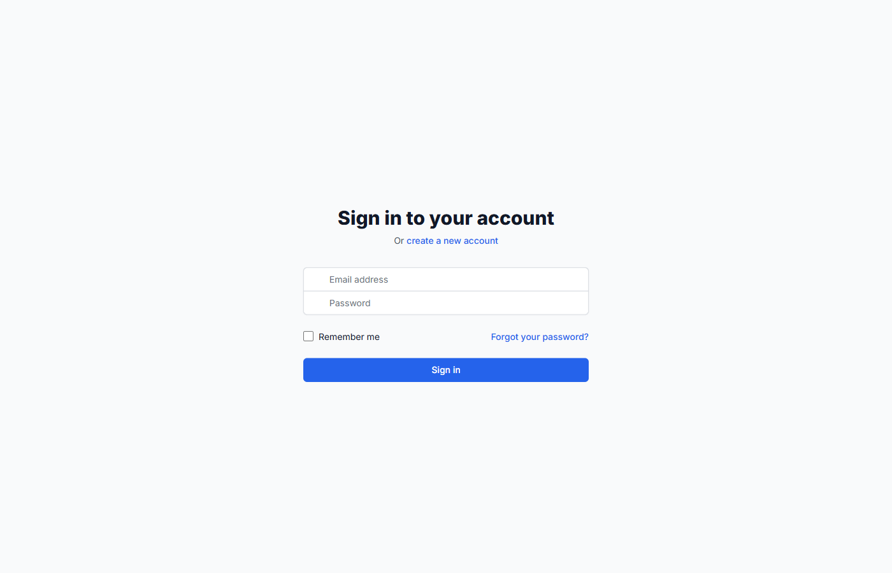

<div align="center">

# BusinessPro Dashboard

### A full-featured business analytics dashboard with cloud-synced settings

Real-time KPIs, revenue tracking, customer analytics, traffic breakdowns, 8 custom D3 chart types, and dark mode — all backed by AWS.

[](https://main.d2mh65j13852hw.amplifyapp.com)

[](https://react.dev/)
[](https://www.typescriptlang.org/)
[](https://vitejs.dev/)
[](https://d3js.org/)
[](https://aws.amazon.com/amplify/)
[](#testing)

</div>

---

<div align="center">
  
  <p><em>Authentication screen — dashboard views are behind Cognito login</em></p>
</div>

---

## What It Does

| Page | What You See |
|:-----|:-------------|
| **Dashboard** | KPI cards, revenue line chart, traffic pie chart, recent activity feed, top products |
| **Analytics** | Traffic sources, user behavior heatmap (hour x day), conversion funnels, cohort analysis |
| **Revenue** | Monthly trends, YoY comparison, custom goal setting with modal |
| **Customers** | New vs returning, lifetime value, churn metrics |
| **Products** | Top products ranked by sales, revenue, and growth |
| **Settings** | Theme, language, timezone, notification thresholds, integrations — all synced to DynamoDB |

---

## Tech Stack

| Layer | Technology |
|:------|:-----------|
| **Frontend** | React 18 + TypeScript 5 + Vite 7 |
| **Styling** | Tailwind CSS 3 (dark mode via `class` strategy) |
| **Charts** | D3.js 7 — 8 custom SVG components (~2,800 LOC) |
| **Data** | TanStack Query 5 (caching, stale times, optimistic updates) |
| **Routing** | React Router v6 (lazy-loaded pages, URL param sync) |
| **Auth** | AWS Cognito (JWT, email verification, optional MFA) |
| **API** | API Gateway + Lambda (Node.js) — REST endpoints |
| **Database** | Amazon DynamoDB (settings persistence) |
| **Infra** | AWS Amplify Gen 2 (IaC — backend defined in TypeScript) |
| **Testing** | Vitest + React Testing Library |

---

## Charts (8 Custom D3 Components)

All charts are built from scratch with D3.js and rendered as SVG — no chart library dependency.

| Chart | Used In |
|:------|:--------|
| LineChart | Revenue trends, session data |
| MultiSeriesLineChart | YoY revenue comparison |
| PieChart | Traffic sources, device breakdown |
| BarChart | Top products, acquisition channels |
| AreaChart | User growth, page views |
| Heatmap | User behavior (hour x day of week) |
| UserJourneySankey | Conversion flow visualization |
| ChartShowcase | Interactive demo of all chart types |

---

## Architecture Highlights

- **Optimistic Updates** — UI updates instantly, reverts on API failure, 1.2s minimum save indicator
- **Debounced Inputs** — 800ms delay on number fields to prevent API spam
- **Conditional Backend** — Automatically falls back to mock data when AWS isn't configured
- **Live Data** — 30s auto-refetch with background polling for real-time metrics
- **URL Param Sync** — Settings tabs bookmarkable via `?tab=notifications`
- **Fixed Notifications** — All toasts use `position: fixed` to avoid layout shift
- **Lazy Loading** — All 13 pages loaded via `React.lazy()` + `Suspense`

---

## Project Structure

```
src/
├── components/
│   ├── charts/           8 custom D3 SVG chart components
│   ├── layout/           Header, Sidebar, DashboardLayout, RootLayout
│   ├── settings/         ProfileTab, DashboardTab, NotificationsTab, IntegrationsTab
│   ├── auth/             ProtectedRoute
│   └── ui/               LoadingSpinner, ErrorBoundary, NotificationPopup
├── hooks/                useAuth, useSettings, useDashboard, useAnalytics, useTheme
├── pages/                13 lazy-loaded pages
├── services/             JWT API client, mock API fallback, unified API layer
├── constants/            app timing, breakpoints, settings defaults
├── types/                TypeScript interfaces (KPI, Revenue, Traffic, Settings)
└── data/                 mock data for development

amplify/
├── backend.ts            IaC: DynamoDB, Lambda, API Gateway, Cognito
└── functions/api/        dashboard.ts, analytics.ts, settings.ts (Lambda handlers)
```

---

## Testing

**96 tests** across 11 files covering auth flows, settings management, layout, and utilities.

```bash
npm run test:run         # single run
npm run test:coverage    # with coverage report
```

| Category | What's Tested |
|:---------|:--------------|
| **Auth** | Login, register, logout, error handling, token retrieval |
| **Settings** | Defaults, updates, reset, integrations, API key generation |
| **Pages** | Login + register forms, validation, submission, error display |
| **Layout** | Sidebar nav, user display, header search, notifications |
| **Utilities** | Settings export (JSON/CSV), config security |

---

## Getting Started

```bash
git clone https://github.com/Rohit23SR/BusinessPro-Analytics.git
cd BusinessPro-Analytics
npm install
npm run dev
```

Open [http://localhost:5173](http://localhost:5173). Works with mock data out of the box — no AWS setup needed.

### Optional: Connect AWS backend

```bash
npm install -g @aws-amplify/cli
amplify configure
npm run amplify:sandbox
```

---

## Scripts

| Command | Description |
|:--------|:------------|
| `npm run dev` | Vite dev server (port 5173) |
| `npm run build` | Production build |
| `npm run test:run` | Run all tests |
| `npm run test:coverage` | Coverage report |
| `npm run lint` | ESLint check |
| `npm run format` | Prettier format |
| `npm run amplify:sandbox` | Local dev backend |

---

## License

Private and proprietary.
